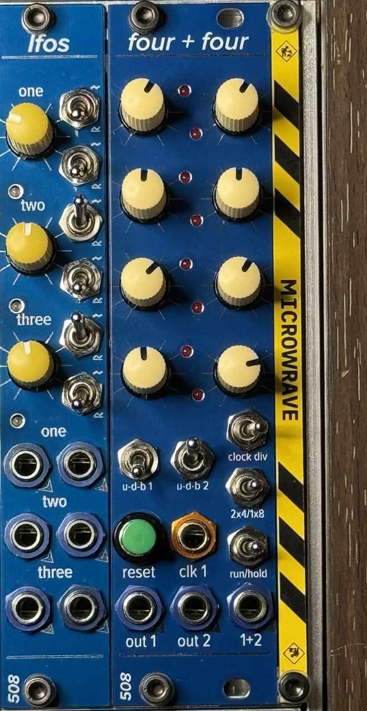

# four + four

I wanted to do a Moroder-like thing with a 4-step sequence that gets transposed every 4 bars -- easy enough to do with a clock divider & a second sequencer or sequential switch, plus an adder. But I wanted it in a single module, ideally something small to fit into a travel case.

This is the result. Two 4-step sequencers with one clock input. The one on the left runs at the clock rate. The one on the right can run at the clock rate, or 1/4 the clock rate, or 1/16 the clock rate.

There is a separate output for each sequencer's CV, plus a summed output (summed thru a low-offset precision op amp, no less).

Each sequencer is separately switchable between counting up or down or "bounce" -- changing direction when it reaches either end.

There is also a switch that converts the whole thing into a single 8-step sequencer (use the first output in this mode, although the other two outputs are also still live, and they do more or less what you'd expect).

Each knob has a range of +/- 2.5V, give or take, with 0v at top dead center. I use center-detent pots to make finding the middle easier. You can change the voltage by varying R2 and R3 on the main board. The formula is on the schematic.

If I do a new revision of this I might have the left four pots be 0-5V and the right four stay +/- 2.5V.

The clock division switch is an SP3T, which is *different* from a DPDT, although unfortunately many vendors sell them as "DPDT on-on-on." It looks like like a DPDT, so don't get them confused! I did this once & it was . . . confusing.

I use these: https://lovemyswitches.com/taiway-sub-mini-dpdt-on-on-on-switch-pcb-mount-long-shaft/

It is important that you get a "type 2" (just buy the one I linked) because there are two types, and the difference is in the handed-ness, in terms of which side goes where when the toggle is in the middle position. Each type is rotationally symmetrical but they are not the same.

This module, like many of my modules, uses 2mm-pitch male/female headers. Be sure you order/use the right thing!

Most ICs are SOIC 8/14/16; all passives are 0805. The BOMs prefixed with `fixed` are easier to read; the others can be used along with the Pick-and-place and gerber files to order PCBs.

